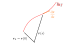

# Ray Equation

光は，波動性 (回折など) を無視することで，１本の**光線** (ray) 上を伝わるとみなすことができる．
このような単純化は幾何光学近似とよばれ，光の屈折などの計算でよく使われる．

光線は，一様でない密度分布を通るとき，それぞれの点で屈折して曲線となる．
下図のような光線を考える．
光線上に基準点を１つとり，その位置ベクトルを $\vb\*{r}\_0$ とする．
基準点 $\vb\*{r}\_0$ から光線に沿って測った距離 (**弧長**, arc length) が $s$ となるような，光線上の点の位置ベクトルを $\vb\*{r}(s)$ とかくことにする ($\vb\*{r}(0) = \vb\*{r}\_0$ である)．

<!--  -->

弧長が $\Delta s$ だけ離れた２点 $\vb\*{r}(s), \vb\*{r}(s\+\Delta s)$ に対し，
$$
\begin{equation}
\dv{ \vb*{r} }{s} = \lim_{\Delta s \to 0} \frac{ \vb*{r}(s+\Delta s) - \vb*{r}(s) }{\Delta s}
\end{equation}
$$
は，点 $\vb\*{r}(s)$ における光線方向の単位ベクトルを表している．
このベクトルと，屈折率 $n \qty(\= \frac{c\_0}{c})$ ($c\_0$ は真空中の光速， $c$ は物質中の各点での光速) との間には，次の**ray equation**が成り立つことが知られている:
$$
\begin{equation}
	\dv{s} \qty( n \dv{\vb*{r}}{s} ) = \grad n \label{eq:rayeq}
\end{equation}
$$
以下，このray equationの導出について説明する．

### 前提

電荷のない空間のMaxwell方程式を出発点とする:
$$
\begin{align}
& \curl{\vb\*{E}}(\vb\*{r}, t) = - \pdv{\vb\*{B}(\vb\*{r}, t)}{t} \\
& \curl{\vb\*{H}}(\vb\*{r}, t) = \pdv{\vb\*{D}(\vb\*{r}, t)}{t} + \vb\*{j}(\vb\*{r}, t) \\
& \div{\vb\*{B}(\vb\*{r}, t)} = \vb\*{0} \\
& \div{\vb\*{D}(\vb\*{r}, t)} = \vb\*{0}
\end{align}
$$
ただし $\vb\*{E}$ は電場 (electric vector), $\vb\*{H}$ は磁場 (magnetic vector), $\vb\*{D}$ は電束密度 (electric displacement), $\vb\*{B}$ は磁束密度 (magnetic induction), $\vb\*{j}$ は電流密度 (electric current density)．

### 参考文献
- Träger, "Springer Handbook of Lasers and Optics," Springer, 2012. Sec. 2.1.